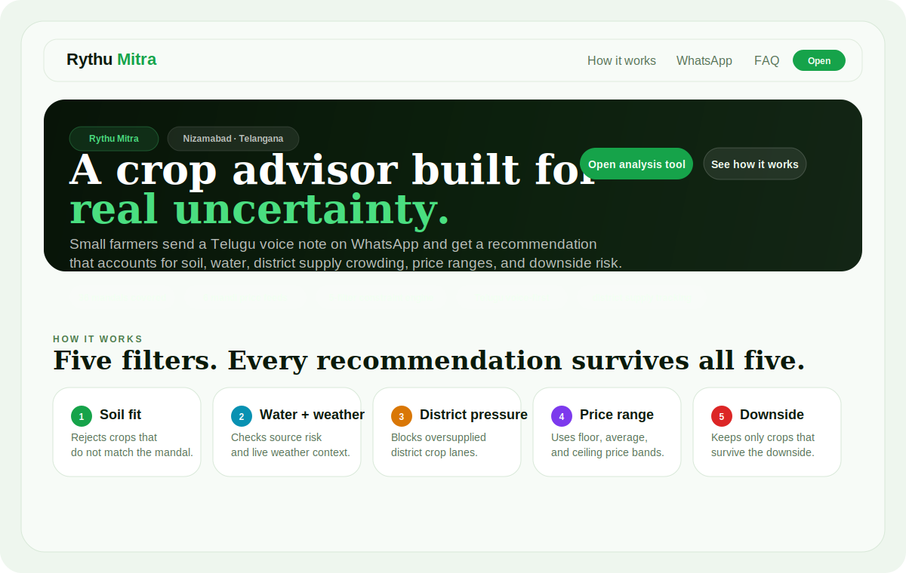
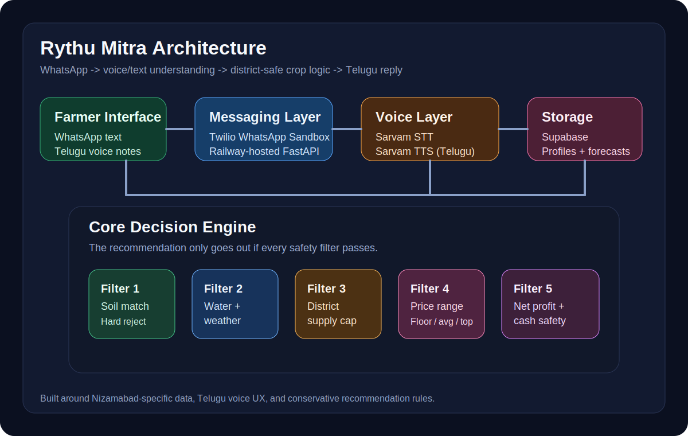
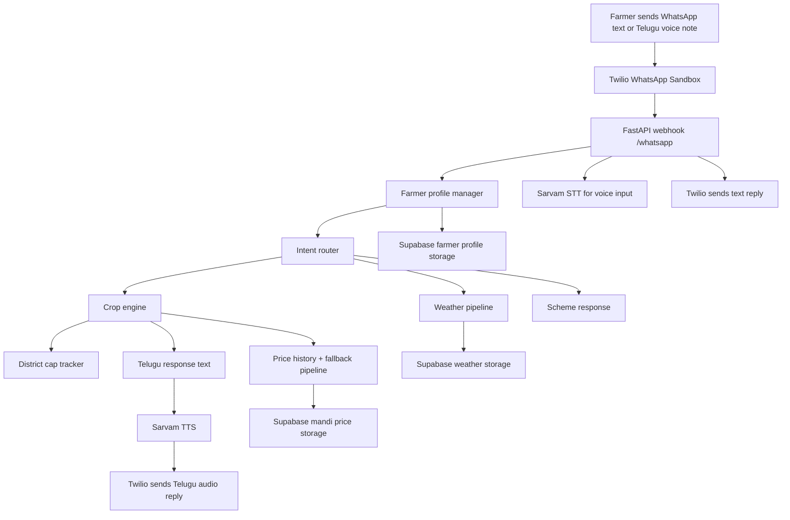

# Rythu Mitra

**A WhatsApp-based Telugu agricultural assistant built for small farmers in Nizamabad, Telangana.**

[](requirements.txt)
[](bot/whatsapp_handler.py)
[](scripts/create_farmer_profiles_table.sql)
[](bot/whatsapp_handler.py)
[](Procfile)
[](scripts/test_engine.py)

Rythu Mitra is a district-specific farming copilot built around one constraint: it should feel like a knowledgeable son helping his father over WhatsApp, not like software asking a farmer to learn software.

Built from a real family problem, the project combines Telugu voice UX, conservative crop recommendation logic, district market safeguards, and live messaging infrastructure.
## TL;DR

- **Input:** WhatsApp text or Telugu voice notes
- **Core output:** crop recommendation with district-aware safety checks
- **Region:** Nizamabad district, Telangana
- **Interfaces:** Twilio WhatsApp, FastAPI, Sarvam STT/TTS, Supabase, Railway
- **Current strength:** a working 5-filter recommendation engine, deployable WhatsApp voice flow, and runnable React dashboard
- **Key differentiator:** the bot tracks district planting pressure so it does not create a new oversupply rat race

## Quick Links

- [Engine test](scripts/test_engine.py)
- [WhatsApp webhook](bot/whatsapp_handler.py)
- [Dashboard app](dashboard/src/App.jsx)
- [District data](data/nizamabad_district.py)

## Dashboard Preview



## Architecture Preview



## If You Are A Recruiter Or Hiring Manager

This is the fastest way to evaluate the project.

- **Real problem, real user**
  The product is built around a founder’s own farming family in Nizamabad, not an invented startup use case.
- **More than an LLM wrapper**
  The repo includes data modeling, deterministic recommendation logic, district-level market safeguards, voice UX, pipelines, deployment, and live messaging infrastructure.
- **Good product judgment**
  The system avoids fake certainty. It uses hard rejects, price ranges, floor-price safety checks, and explicit “no guarantee” language.
- **Built with operational constraints in mind**
  The app is designed for WhatsApp voice notes in Telugu because that matches how the target user actually communicates.
- **Shows strong engineering taste**
  The project separates ML dependencies from deploy dependencies, keeps fallbacks for unstable APIs, and is honest about what is production-ready versus still in progress.

If you only read three sections, read:

1. [Why This Project Is Different](#why-this-project-is-different)
2. [Example Recommendation](#example-recommendation)
3. [Why This Belongs In A Portfolio](#why-this-belongs-in-a-portfolio)

## If You Are A Developer

This is the fastest path to understanding the codebase.

- **Read these files first**
  [`data/nizamabad_district.py`](data/nizamabad_district.py),
  [`engine/crop_engine.py`](engine/crop_engine.py),
  [`bot/farmer_profile.py`](bot/farmer_profile.py),
  [`bot/whatsapp_handler.py`](bot/whatsapp_handler.py)
- **Run these first**
  `python3 scripts/test_engine.py` and `python3 scripts/test_whatsapp_voice.py`
- **Know the current boundaries**
  Crop recommendations, weather ingest, progressive farmer profiling, WhatsApp routing, and the dashboard are real. Disease diagnosis and proactive alerts are still partial.
- **Know the external dependencies**
  Supabase, Twilio, and Sarvam are required for the full live flow. `data.gov.in` is optional today because the project already supports historical and fallback price paths.
- **Know where the bot starts**
  The live app entrypoint is [`bot/whatsapp_handler.py`](bot/whatsapp_handler.py).

## What This Project Demonstrates

- Product thinking grounded in a real user and real operating constraints
- Deterministic decision logic layered with voice AI rather than replaced by it
- Careful handling of uncertainty in a high-stakes domain
- End-to-end backend ownership: data, logic, APIs, persistence, deployment, and testing
- Strong portfolio narrative without depending on flashy UI

## Demo Flow

This is what the product experience is trying to feel like in practice.

```text
Farmer -> voice note: "nandipet"
Bot -> asks for acres

Farmer -> voice note: "10 acres"
Bot -> asks for soil and water

Farmer -> voice note: "deep calcareous mixed water"
Bot -> asks for last crops and loan

Farmer -> voice note: "last crop paddy, loan 2 lakh undi"
Bot -> runs the full engine and replies in Telugu text first, then Telugu audio
```

Expected recommendation for the main smoke-test profile:

```text
Top pick: maize
Second pick: cotton
Rejected: paddy, turmeric
Reason: district supply pressure
```

## Run The Dashboard

```bash
python3 scripts/export_dashboard_data.py
cd dashboard
npm install
npm run dev
```

Then open:

```text
http://localhost:4173
```

After Railway redeploys, the same UI will be served from:

```text
https://<your-railway-domain>/dashboard
```

## Why This Project Is Different

Most agriculture assistants stop at “best crop for your soil.”  
Rythu Mitra goes further and asks a more honest question:

**“Even if a crop grows well here, should we still recommend it if half the district is already planting it?”**

That is the heart of this project.

### What makes it special

- **Voice-first for real usage**
  Small farmers should be able to use this through WhatsApp voice notes in Telugu, not through forms.
- **District-specific logic**
  The system is built around Nizamabad mandals, mandis, crop history, soil zones, and scheme context.
- **Five hard recommendation filters**
  A crop is rejected if it fails soil, water/weather, supply cap, price logic, or floor-price profitability.
- **Price ranges, never fake precision**
  The engine always gives floor, average, and ceiling prices instead of pretending it can guarantee one number.
- **Human tone**
  The Telugu response is intentionally warm and specific, not clinical or robotic.

## What Is Built Today

### Working now

- **District data layer**
  `36` mandals, `15` crop profiles, `6` mandis, government schemes, district weather profile, acreage baselines
- **Recommendation engine**
  Season filter + 5-filter crop selection + Telugu response generator
- **District cap tracker**
  Per-season recommendation logging to avoid the bot pushing too many farmers into the same crop
- **Weather pipeline**
  Live Open-Meteo forecast pull for Nizamabad with hourly and daily normalization
- **Price pipeline**
  Historical + fallback mandi price pipeline, with live `data.gov.in` support ready when an API key is available
- **WhatsApp bot**
  FastAPI webhook, progressive farmer profiling, intent routing, Sarvam STT/TTS integration, Twilio-compatible responses
- **Dashboard**
  A runnable React command view for district opportunity, mandi prices, weather context, and bot walkthroughs
- **Deployment path**
  Railway-ready runtime config and live webhook routes

### Scaffolded / partially built

- Disease model training and inference files
- Proactive monitoring and drying alerts
- Season calendar automation
- Future dashboard polish, richer visuals, and production data refresh

## Current Project Status

### Stable core

- Crop engine works locally and passes the Nandipet smoke test
- Weather pipeline is live and functional
- Price pipeline works with historical and fallback data even without `data.gov.in`
- WhatsApp text flow works
- WhatsApp voice flow is implemented end-to-end in code
- Dashboard builds successfully and uses exported backend data

### Still evolving

- Live `data.gov.in` mandi pulls require an API key
- Disease diagnosis is scaffolded but not fully integrated into the bot
- Dharani survey-number to soil lookup is not wired yet
- The dashboard is functional, but it is still a local frontend app rather than a production-integrated surface

## Example Recommendation

The main smoke test uses this profile:

- **Mandal:** Nandipet
- **Land:** 10 acres
- **Soil:** deep calcareous
- **Water:** mixed
- **Last crop:** paddy
- **Loan burden:** ₹2,00,000

Expected result from the current engine:

- **Top pick:** maize
- **Second pick:** cotton
- **Rejected:** paddy and turmeric because district supply is already too high

Run it locally:

```bash
python3 scripts/test_engine.py
```

## How The Recommendation Engine Works

The engine in [`engine/crop_engine.py`](engine/crop_engine.py) is built around five filters.

1. **Filter 1: Soil match**
   Hard reject if the crop does not fit the farmer’s soil zone.
2. **Filter 2: Water + weather match**
   Uses water source plus season-aware weather guidance and live short-term forecast when available.
3. **Filter 3: District supply cap**
   Compares planted acreage plus bot recommendations against a safe district cap.
4. **Filter 4: Price prediction**
   Uses multi-year history and weighted recent trends to output floor, average, and ceiling prices.
5. **Filter 5: Net profit + cash survivability**
   Rejects crops that fail at floor price or look unsafe under loan pressure.

### Non-negotiable behavior

- Never recommend a crop without all filters running
- Never output a single price as if it were guaranteed
- Always include a no-guarantee disclaimer in Telugu
- Never ignore district crowding pressure
- Reject crops that lose money at floor price

## End-to-End Flow



## Repository Tour

```text
rythu-mitra/
├── bot/
│   ├── farmer_profile.py      # Progressive profile collection over 3-4 messages
│   ├── intent_classifier.py   # Weather / scheme / disease / crop routing
│   ├── telugu_voice.py        # Sarvam STT + TTS helpers
│   ├── whatsapp_handler.py    # FastAPI webhook, media handling, Twilio replies
│   ├── proactive_monitor.py   # Scaffold for future proactive alerts
│   └── drying_alerts.py       # Scaffold for future drying alerts
├── data/
│   ├── nizamabad_district.py  # District ground truth: mandals, crops, schemes, weather
│   ├── price_history.csv      # Historical mandi price backfill
│   ├── price_history.json     # Additional bundled history
│   ├── schemes.py             # Scheme helpers
│   └── recommendation_log.json# Per-season recommendation history
├── dashboard/
│   ├── package.json           # Vite React dashboard app
│   ├── index.html
│   ├── src/App.jsx
│   ├── src/data/dashboardData.json
│   ├── src/components/DistrictMap.jsx
│   ├── src/components/MandiPrices.jsx
│   ├── src/components/BotDemo.jsx
│   └── src/styles.css
├── disease/
│   ├── train.py               # Training scaffold
│   ├── model.py               # Model scaffold
│   └── inference.py           # Inference scaffold
├── docs/
│   ├── dashboard-preview.svg
│   ├── architecture.svg
│   ├── architecture.png
│   ├── logic.pdf
│   └── scenarios.pdf
├── engine/
│   ├── crop_engine.py         # 5-filter recommendation engine
│   ├── district_cap.py        # Recommendation log + acreage aggregation
│   ├── price_pipeline.py      # Historical/fallback/live mandi price pipeline
│   ├── weather_pipeline.py    # Open-Meteo forecast normalization + storage
│   └── season_calendar.py     # Scaffold for season schedule generation
├── scripts/
│   ├── create_farmer_profiles_table.sql
│   ├── create_mandi_prices_table.sql
│   ├── create_weather_forecast_tables.sql
│   ├── export_dashboard_data.py
│   ├── seed_supabase.py
│   ├── test_engine.py
│   └── test_whatsapp_voice.py
├── Procfile
├── runtime.txt
├── requirements.txt
├── requirements-ml.txt
└── README.md
```

## Tech Stack

- **Backend:** FastAPI
- **Messaging:** Twilio WhatsApp Sandbox
- **Voice:** Sarvam AI STT + TTS
- **Database:** Supabase
- **Weather:** Open-Meteo
- **Hosting:** Railway
- **ML training:** PyTorch stack kept separate in `requirements-ml.txt`

## Data Model Snapshot

From [`data/nizamabad_district.py`](data/nizamabad_district.py):

- `36` mandals
- `6` mandis
- `15` crop profiles
- `14` crops currently active for recommendation
- district acreage baselines
- scheme information
- weather profile and disease-risk calendar

This repo tries to stay explicit about what is:

- district-specific and grounded
- live and fetched from APIs
- fallback or legacy-official reference data

That distinction matters because this is a decision-support system, not a demo with invented numbers.

## Quick Start

### 1. Prerequisites

- Python `3.12.7`
- A Supabase project
- A Twilio account with WhatsApp sandbox enabled
- A Sarvam API key

### 2. Create a virtual environment

```bash
python3 -m venv .venv
source .venv/bin/activate
```

### 3. Install runtime dependencies

```bash
pip install -r requirements.txt
```

If you are working on the disease model locally, install the heavier stack too:

```bash
pip install -r requirements-ml.txt
```

### 4. Create your environment file

```bash
cp .env.example .env
```

### 5. Fill the important variables

At minimum, for the bot runtime:

```env
SUPABASE_URL=...
SUPABASE_SERVICE_ROLE_KEY=...
SARVAM_API_KEY=...
TWILIO_ACCOUNT_SID=...
TWILIO_AUTH_TOKEN=...
TWILIO_WHATSAPP_NUMBER=...
PUBLIC_BASE_URL=...
```

Useful notes:

- The code also accepts fallback names such as `SUPABASE_KEY`, `SUPABASE_ANON_KEY`, `SARVAM_KEY`, `TWILIO_SID`, and `TWILIO_TOKEN`.
- `DATA_GOV_API_KEY` is optional. Without it, the price pipeline uses bundled history and fallback rows.
- `TWILIO_WHATSAPP_NUMBER` should be the sender number **without** the `whatsapp:` prefix.

## Local Development

### Run the API locally

```bash
uvicorn bot.whatsapp_handler:app --reload
```

Useful local routes:

- `GET /`
- `GET /health`
- `POST /whatsapp`
- `GET /media/{filename}`

### Run the engine smoke test

```bash
python3 scripts/test_engine.py
```

### Run the local voice smoke test

```bash
python3 scripts/test_whatsapp_voice.py
```

The voice smoke test exercises the WhatsApp flow end-to-end inside the app using generated audio and requires a working Sarvam key in `.env`.

### Run the dashboard locally

```bash
python3 scripts/export_dashboard_data.py
cd dashboard
npm install
npm run dev
```

## Supabase Setup

If you want Supabase tables created manually, run these in the Supabase SQL editor:

- [`scripts/create_mandi_prices_table.sql`](scripts/create_mandi_prices_table.sql)
- [`scripts/create_weather_forecast_tables.sql`](scripts/create_weather_forecast_tables.sql)
- [`scripts/create_farmer_profiles_table.sql`](scripts/create_farmer_profiles_table.sql)

Then seed data:

```bash
python3 scripts/seed_supabase.py
```

## Pipelines

### Weather pipeline

File: [`engine/weather_pipeline.py`](engine/weather_pipeline.py)

- pulls forecast data from Open-Meteo
- normalizes hourly rain probability and daily temperature data
- writes to Supabase when configured
- falls back to local JSON cache when remote storage is unavailable

### Price pipeline

File: [`engine/price_pipeline.py`](engine/price_pipeline.py)

- supports historical CSV backfill
- supports live `data.gov.in` mandi fetches when an API key is present
- normalizes six target mandis
- falls back to district crop history when live pulls are unavailable

## WhatsApp + Voice Setup

1. Deploy the app to Railway
2. Set all runtime environment variables in Railway
3. Generate a public Railway domain
4. Set `PUBLIC_BASE_URL` to that domain
5. In Twilio WhatsApp Sandbox, set the incoming webhook to:

```text
https://<your-domain>/whatsapp
```

6. Join the sandbox from your phone using the join code shown in Twilio
7. Test the profile flow through text first, then voice

### Example text flow

1. `nandipet`
2. `10 acres`
3. `deep calcareous mixed water`
4. `last crop paddy, loan 2 lakh undi`

### Example voice flow

Send the same four inputs as short separate voice notes.

## Railway Notes

This repo separates deployment dependencies from ML training dependencies on purpose:

- [`requirements.txt`](requirements.txt) is the lean web runtime
- [`requirements-ml.txt`](requirements-ml.txt) holds the heavy disease-model stack

That split is important because free-tier Railway builds can fail if PyTorch is included in the web image.

The dashboard is currently a separate Vite app and is not yet bundled into the FastAPI deployment.

## Safety, Trust, and Product Principles

This project is opinionated about agricultural decision support.

- It is better to reject a crop than to recommend a risky one confidently.
- It is better to show a range than a fake precise number.
- It is better to admit uncertainty than to overpromise.
- It is better to slow down onboarding than to ask a farmer to fill a long form.

That is why the code emphasizes:

- hard filters
- conservative pricing
- district crowding awareness
- gradual profile collection
- Telugu responses that sound personal, not generic

## Known Limitations

- `data.gov.in` live mandi data still depends on obtaining an API key
- Twilio sandbox and account-level daily limits can interrupt live testing
- Disease detection is scaffolded but not yet fully wired into the WhatsApp flow
- Soil can be collected manually today, but Dharani survey-number lookup is not integrated yet
- The dashboard is functional, but it is still a local frontend app rather than a production-integrated surface

## Roadmap

- Finish disease model integration with confidence thresholds
- Add proactive disease alerts based on weather + crop stage
- Add drying-weather alerts for harvest/post-harvest use
- Complete season calendar automation
- Add production data refresh and FastAPI/static integration for the dashboard
- Replace all remaining legacy reference baselines with fresher season data where available

## Why This Belongs In A Portfolio

This project is not a toy CRUD app and not a generic LLM wrapper.

It combines:

- domain-specific data modeling
- operational safety logic
- voice UX for a non-English user base
- real messaging infrastructure
- data pipelines
- deployment constraints
- product taste shaped by a real family problem

If it succeeds, it is not because it looks flashy.  
It succeeds because a small farmer can actually use it.

## Important Files To Read First

If you only want the fastest path through the codebase, start here:

1. [`data/nizamabad_district.py`](data/nizamabad_district.py)
2. [`engine/crop_engine.py`](engine/crop_engine.py)
3. [`bot/farmer_profile.py`](bot/farmer_profile.py)
4. [`bot/whatsapp_handler.py`](bot/whatsapp_handler.py)
5. [`engine/weather_pipeline.py`](engine/weather_pipeline.py)
6. [`engine/price_pipeline.py`](engine/price_pipeline.py)

## Final Note

Rythu Mitra is trying to do something simple and difficult at the same time:

**take serious agricultural reasoning and deliver it through the most familiar interface a farmer already uses.**

That constraint shapes everything in this repo.
